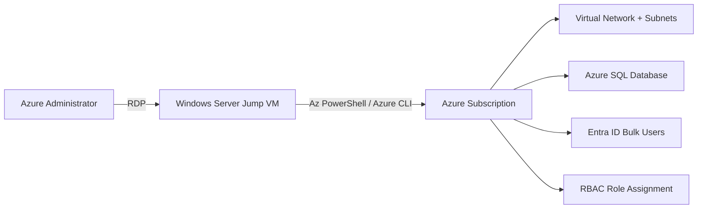

# Azure Administration — VNet, SQL, Entra ID & RBAC (Lab 03)

Welcome to your Azure Administration hands-on skills assessment. This environment gives you a live Windows Server jump VM and a dedicated Azure subscription, resource group, and Entra ID directory to work in. Read this page, then move to **Exercise 1** to begin.

### Overall Estimated timing: 120 Minutes

## Overview

In this assessment you act as an **Azure Administrator** standing up core infrastructure for a new workload. From a Windows jump VM you connect to the lab's Azure subscription and build out networking, a managed database, identities, and access control. You will create a virtual network with subnets, deploy an Azure SQL Database and connect to it, bulk-provision Microsoft Entra ID users, and assign an Azure RBAC role. You are graded on the **state of the Azure resources** in the lab resource group, subscription, and directory.

## Objectives

By the end of this assessment you will have:

1. **Configured a virtual network** with at least two subnets in the lab resource group.
2. **Deployed an Azure SQL Database** and connected to it from the jump VM.
3. **Created Microsoft Entra ID users in bulk** following a naming convention.
4. **Created a user and assigned it an Azure RBAC role** scoped to the lab resource group.

## Pre-requisites

Working knowledge of Azure administration: the Azure portal, Azure CLI (`az`) and Azure PowerShell (`Az` module); Azure Virtual Network and subnets; Azure SQL logical servers, databases and server firewall rules; Microsoft Entra ID (Azure AD) user management; and Azure role-based access control (RBAC) role assignments.

## Architecture

A single Windows Server jump VM is your control point. You connect to it over RDP, sign in to the lab's Azure subscription with Az PowerShell / the Azure CLI, and create all resources in the lab's resource group, subscription, and Entra directory.

## Getting Started with the lab

Your virtual machine and this **Guide** are available within your web browser. Use the **Split Window** button at the top-right to open the guide beside your desktop session.

## Accessing Your Lab Environment

1. Connect to the Lab VM over RDP using the details on the **Environment** tab.

    - **RDP command:** see the **LABVM RDP Command** output on the **Environment** tab
    - **Username:** see the **LABVM Admin Username** output on the **Environment** tab
    - **Password:** see the **LABVM Admin Password** output on the **Environment** tab

1. Sign in to the Azure portal (and `Connect-AzAccount` / `az login` on the VM) with the credentials below:

    - **Email/Username:** <inject key="AzureAdUserEmail"></inject>

    - **Password:** <inject key="AzureAdUserPassword"></inject>

1. Your environment id for this run is **<inject key="DeploymentID" enableCopy="false"/>** — quote it if you contact support.

## Track Your Progress

Use the **Validate** button on each task to check your work. The **Progress** tab shows your validation score; it reaches 100% when all task validations pass.

## Lab Duration Extension

You have **120 minutes** for this assessment. If you need more time, click the **Hourglass** icon in the top-right of the lab environment (it appears when 10 minutes remain) and click **OK**.

## Support Contact

The CloudLabs support team is available 24/7 via email and live chat.

- Email Support: cloudlabs-support@spektrasystems.com
- Live Chat Support: https://cloudlabs.ai/labs-support

Click **Next** to begin Exercise 1.

## Happy Assessing !!
